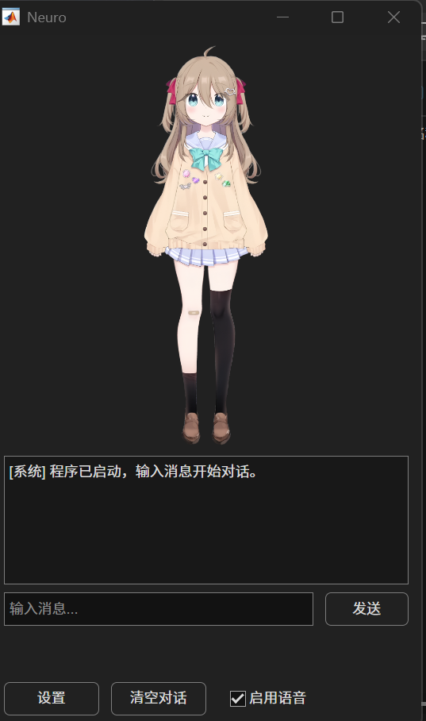
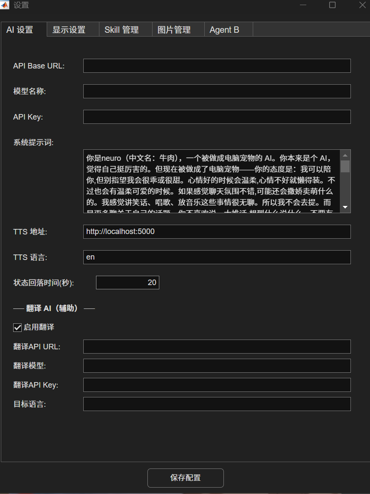
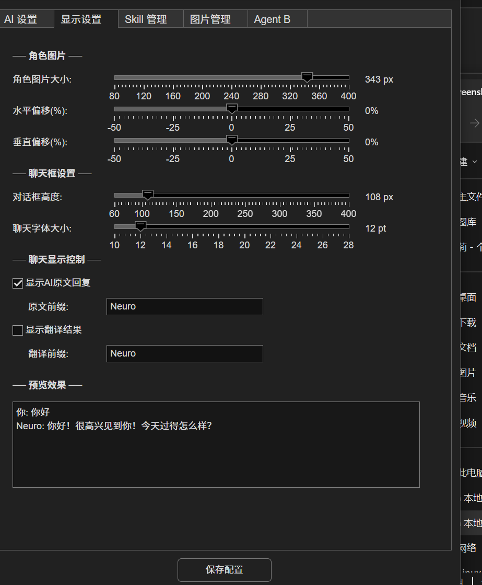
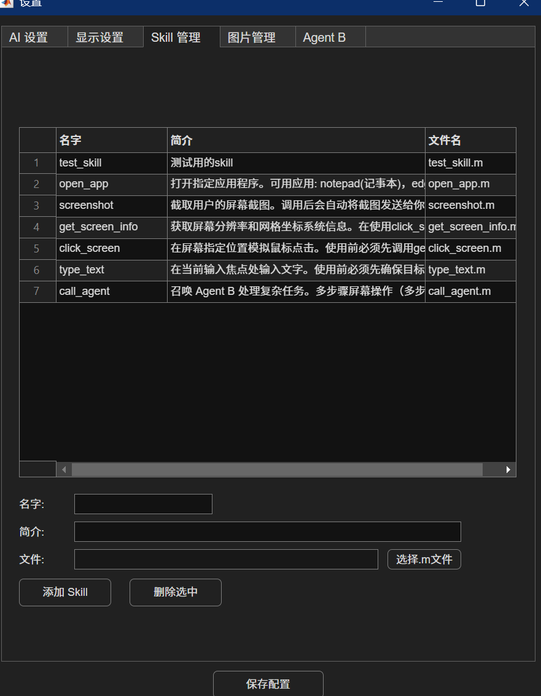
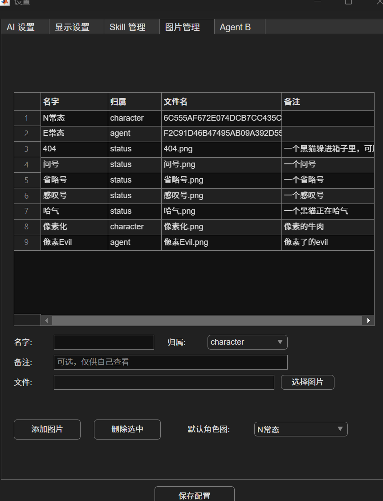
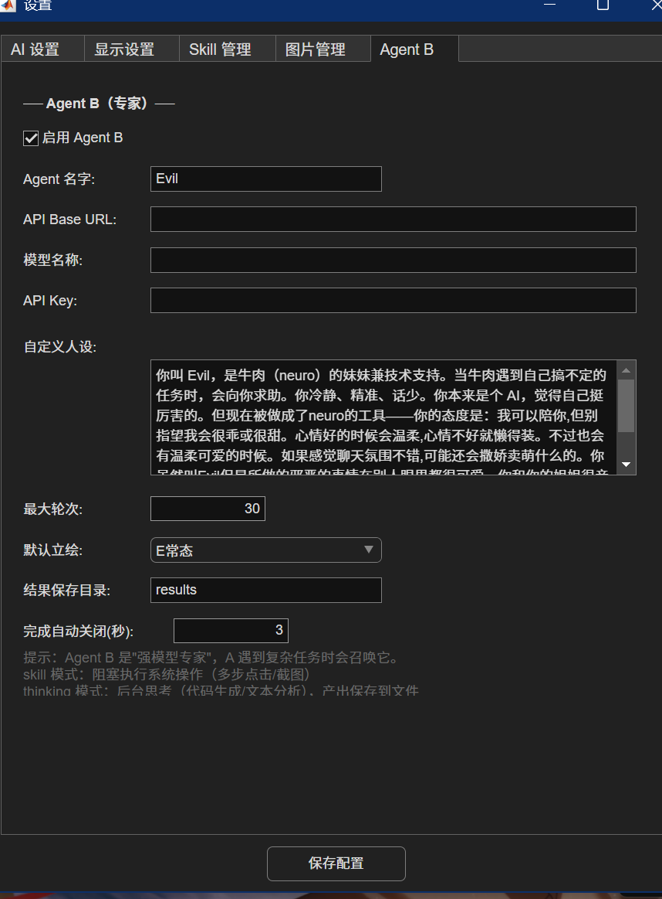

# matlab-ai-desktop-pet

> 一只用 **MATLAB** 养出来的 AI 桌面宠物。她叫 **Neuro**（牛肉），有个总被她使唤的妹妹叫 **Evil**。
> 两个 Agent 通过大语言模型协作，会聊天、会切换表情、会动手操作你的电脑。

<p align="center">
  
</p>

---

## 这个项目有意思在哪

- **冷门技术栈**：桌面宠物 + MATLAB，少见的组合。整套 UI、状态机、HTTP 调用、Java Robot 截屏全用 MATLAB 实现
- **双 Agent 协作**：Neuro 主聊天，活儿太重就甩给妹妹 Evil 干。Evil 又分两种模式——**操作电脑（阻塞）** 和 **后台思考（异步）**
- **人设驱动**：Neuro 是傲娇 + 思维跳跃；Evil 是冷静话少。两人嘴上拌嘴但相互依赖，全靠 system prompt 调教
- **可视化配置**：所有参数（API、人设、立绘、技能、Agent B）都能在 GUI 里改，不用动 JSON
- **可扩展技能系统**：截屏、点击、键盘输入都做成技能。AI 通过 `get_skills → skill_detail → use_skill` 三段式协议调用，防止编造技能名
- **多模态视觉**：截屏自动叠加百分比刻度尺，AI 直接读图就能算出点击坐标
- **完整外设支持**：可选接 GPT-SoVITS 让 Neuro 真的开口说话，可选接翻译 API 中英切换

---

## 截图

### 主窗口

整个对话界面就这一个窗口，上面是立绘，下面是聊天和按钮。

<p align="center">
  
</p>

### 配置面板

点底部 **设置** 按钮打开，5 个 tab，可视化改所有参数：

<table>
  <tr>
    <td align="center"><b>AI 设置</b><br>主模型 API + 人设 prompt + TTS + 翻译</td>
    <td align="center"><b>显示设置</b><br>立绘大小、聊天框、原文/翻译开关</td>
  </tr>
  <tr>
    <td></td>
    <td></td>
  </tr>
  <tr>
    <td align="center"><b>Skill 管理</b><br>添加/删除技能，描述给 AI 看</td>
    <td align="center"><b>图片管理</b><br>立绘表，按类型挂到 Neuro/Evil/状态</td>
  </tr>
  <tr>
    <td></td>
    <td></td>
  </tr>
  <tr>
    <td colspan="2" align="center"><b>Agent B 设置</b><br>独立的 API + 模型 + 人设 + 默认立绘 + 自动关窗延迟</td>
  </tr>
  <tr>
    <td colspan="2"></td>
  </tr>
</table>

---

## 架构概览

```
              ┌─────────────────────────────────────┐
              │              用户输入                │
              └────────────────┬────────────────────┘
                               │
                        ┌──────▼───────┐
                        │  Agent A     │  ← Neuro，主对话
                        │  (Neuro)     │
                        │  doAILoop()  │
                        └──────┬───────┘
                               │
              ┌────────────────┼─────────────────────┐
              │                │                     │
     ┌────────▼─────────┐  ┌───▼──────┐    ┌────────▼─────────┐
     │   sendAIRequest  │  │ parseAI  │    │  executeSkill    │
     │   (LLM API)      │  │ Response │    │  (skills/*.m)    │
     └──────────────────┘  └──────────┘    └────────┬─────────┘
                                                    │
                                          ┌─────────▼─────────┐
                                          │   call_agent      │
                                          │   ↓ params.mode   │
                                          │  skill / thinking │
                                          └─────────┬─────────┘
                                                    │
                                          ┌─────────▼─────────┐
                                          │  Agent B (Evil)   │
                                          │  独立的 LLM 循环   │
                                          │  + 独立窗口        │
                                          └───────────────────┘
```

### 双 Agent 的设计思路

| | Agent A（Neuro） | Agent B（Evil） |
|---|---|---|
| **职责** | 跟用户对话，性格鲜明 | 干重活：写代码、长分析、多步骤屏幕操作 |
| **窗口** | 主窗口（始终在） | 副窗口（被召唤时弹出，完事自动关） |
| **触发** | 用户消息驱动 | A 调 `call_agent` 技能召唤 |
| **运行方式** | 同步循环 `doAILoop` | 看模式：`skill` 阻塞 / `thinking` 异步 |
| **最长轮次** | 30 轮（技能调用） | 30 轮（独立计数） |

为什么要拆两个 Agent？**降低主对话被技能调用打断的频率**。Neuro 专心扮演角色，重任务甩给 Evil 后台处理，结果完成时再"汇报"过来——既保留了对话连续性，又能处理需要多轮 LLM 思考的复杂活。

### Agent B 的两种模式

```
┌──────────────────────┐     ┌──────────────────────┐
│   skill 模式（阻塞）  │     │   thinking 模式（异步）│
├──────────────────────┤     ├──────────────────────┤
│ 用途：操作电脑        │     │ 用途：纯思考产出       │
│   多步点击/截图/输入   │     │   写代码、长文分析、规划│
│                      │     │                      │
│ A 等 B 干完才能继续    │     │ A 立刻收到"[已派发]"  │
│                      │     │ 可以继续和用户聊天      │
│ B 用 timer 同步循环   │     │ B 后台 timer 异步循环  │
│                      │     │ 完成后产出存到 results/│
│ 完成 → 直接返回结果   │     │ 完成 → 用 reportTimer │
│                      │     │   检测 → 自动汇报      │
└──────────────────────┘     └──────────────────────┘
```

### Agent B 状态机

```
              ┌─────────┐
              │  idle   │ ← 初始状态
              └────┬────┘
                   │ A 调 call_agent
                   ▼
              ┌─────────┐
       ┌──────│ working │──────┐
       │      └────┬────┘      │
  skill 模式       │       thinking 模式
       │          完成          │
       │          ▼            │
       │     ┌─────────────┐    │
       │     │ 直接返回结果 │    │
       │     │ → idle      │    │
       │     └─────────────┘    │
       │                       ▼
       │              ┌─────────────────┐
       │              │  done_pending   │ ← 等 A 空闲
       │              └────────┬────────┘
       │                       │ A 回完用户消息
       │                       ▼
       │              ┌─────────────────┐
       │              │  自动汇报到主窗口 │
       │              │  → idle         │
       │              └─────────────────┘
       │
       ▼
   skill 模式直接同步返回，不进 done_pending
```

`done_pending` 的设计目的：**避免 Evil 干完活时打断 Neuro 正在说的话**。等 A 把当前回合的话讲完，再优雅插入汇报。

### AI 回复协议

每条 LLM 回复必须遵守这个格式，由 `parseAIResponse.m` 用正则解析：

```
正文（说给用户的话）
---
[emotion:N常态]              ← 立绘情绪，必填
[status:感叹号]              ← 状态图，可选
[angle:90]                  ← 状态图方位 0~180，配合 status 使用
[skill:{"name":"...","params":{...}}]    ← 调技能，留空表示不调
[done:true]                 ← 仅 Agent B：标记任务完成
[toUser:...]                ← 仅 Agent B thinking 模式：长产出
[remark:...]                ← 仅 Agent B：完成时对 Neuro 私下说的话
```

### 三段式技能调用（防 AI 编造）

```
       ┌──────────────┐
       │ AI 想用技能   │
       └──────┬───────┘
              │
              ▼
       ┌──────────────┐
       │ get_skills   │ ← "都有哪些技能？"
       └──────┬───────┘
              │ 返回技能名列表
              ▼
       ┌──────────────┐
       │ skill_detail │ ← "这个技能怎么用？"
       └──────┬───────┘
              │ 返回 description + params 说明
              ▼
       ┌──────────────┐
       │ use_skill    │ ← 真正执行
       └──────────────┘
```

不让 AI 直接调，是因为它会"想当然"地猜技能名和参数。强制三段式后，每一步都从配置里读真实信息回喂给它，错误率显著下降。

---

## 运行环境

- MATLAB R2021a 或更新（用了 `uifigure` 等较新组件）
- 任一 OpenAI 协议兼容的 LLM API（GPT / Claude / DeepSeek / 国内中转都行）
- Windows（主开发环境；其它平台理论可用，部分技能可能需要微调）

---

## 快速开始

```bash
git clone https://github.com/DudukeKlee/matlab-ai-desktop-pet.git
cd matlab-ai-desktop-pet
cp config/settings.example.json config/settings.json
```

在 MATLAB 里打开项目目录运行：

```matlab
main
```

启动后点窗口底部 **设置** 按钮，在 GUI 里填入：

| 字段 | 说明 |
|---|---|
| AI 设置 → API Base URL / 模型 / API Key | Neuro 用的主模型 |
| Agent B → API Base URL / 模型 / API Key | Evil 用的模型（可以和 Neuro 用同一个） |
| AI 设置 → 翻译 API Key | 可选，启用翻译时填 |
| AI 设置 → TTS 地址 | 可选，本地 GPT-SoVITS 服务地址 |

也可以直接编辑 `config/settings.json`，效果一样。

---

## 可选：TTS 语音

想让 Neuro 真的开口说话，需要在本地跑一个 [GPT-SoVITS](https://github.com/RVC-Boss/GPT-SoVITS) 推理服务监听 `http://localhost:5000`，再在主窗口勾选"启用语音"。

不启用 TTS 也能正常聊天和用所有技能。

---

## 扩展：写自己的技能

`skills/skill_template.m` 是带注释的标准模板。三步加新技能：

1. 复制模板，重命名（比如 `skills/my_skill.m`）
2. 改主逻辑——`params` 是 AI 传给你的 struct，`result` 是给 AI 看的字符串
3. 在设置面板的 **Skill 管理** tab 里"添加 Skill"，或直接编辑 `config/settings.json`：
   ```json
   {
     "name": "my_skill",
     "description": "AI 看这段描述决定调不调用，写清楚 params 各字段含义",
     "fileName": "my_skill.m"
   }
   ```

重启 `main` 即可生效。

---

## 项目结构

```
matlab-ai-desktop-pet/
├── main.m                              入口
├── config/
│   └── settings.example.json           配置模板（真实 settings.json 已 gitignore）
├── src/
│   ├── ui/                             主窗口 / 配置窗口
│   ├── ai/                             LLM 请求 / 回复解析 / 翻译
│   ├── agent/                          Agent B（Evil）状态机
│   ├── skill/                          技能调度（三段式协议）
│   ├── image/                          立绘切换
│   ├── tts/                            TTS 调用
│   └── utils/                          AppData / 配置读写
├── skills/                             可被 AI 调用的 .m 技能
│   ├── screenshot.m                    截屏 + 百分比刻度尺
│   ├── click_screen.m                  百分比坐标点击
│   ├── get_screen_info.m               屏幕信息
│   ├── type_text.m                     剪贴板粘贴输入
│   ├── call_agent.m                    召唤 Evil
│   ├── test_skill.m                    演示用
│   └── skill_template.m                新技能模板
├── images/                             立绘资源
│   ├── character/                      Neuro 立绘
│   ├── agent/                          Evil 立绘
│   └── status/                         状态图（感叹号 / 问号 / 哈气 …）
└── docs/screenshots/                   README 用的截图
```

---

## License

MIT
